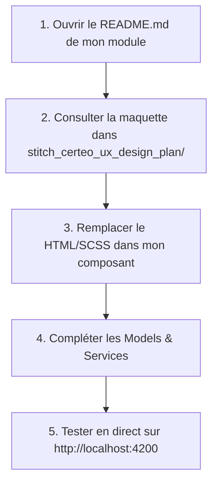

# 📖 Guide & Architecture Frontend — CERTEO

Bienvenue sur la documentation complète du frontend de **CERTEO** (Plateforme de gestion des talents — Orange Digital Center).

Ce document sert de **guide de référence pour toute l'équipe** : structure, conventions, bonnes pratiques, exemples de code et workflow Git pour travailler en parallèle sans conflit.

---

## 📑 Sommaire
1. [Vue d'ensemble & Philosophie](#1-vue-densemble--philosophie)
2. [Arborescence Détaillée : À quoi sert quoi ?](#2-arborescence-détaillée--à-quoi-sert-quoi-)
   - [`core/` : Fondations & Singletons](#21-core--fondations--singletons)
   - [`shared/` : Composants & Utilitaires Transverses](#22-shared--composants--utilitaires-transverses)
   - [`layouts/` : Gabarits de Pages](#23-layouts--gabarits-de-pages)
   - [`features/` : Modules Métier Autonomes](#24-features--modules-métier-autonomes)
   - [`styles/` : Design System & Tokens](#25-styles--design-system--tokens)
3. [Les Path Aliases TypeScript](#3-les-path-aliases-typescript)
4. [Guide Pratique : Comment Développer ? (Exemples)](#4-guide-pratique--comment-développer--exemples)
   - [⚡ Démarche Pas-à-Pas pour le Développeur (Comment démarrer ?)](#-40-démarche-pas-à-pas-pour-le-développeur-comment-démarrer-)
   - [Créer une nouvelle page dans un module](#41-créer-une-nouvelle-page-dans-un-module)
   - [Créer et utiliser un service avec Signals](#42-créer-et-utiliser-un-service-avec-signals)
   - [Utiliser les composants partagés (`@shared`)](#43-utiliser-les-composants-partagés-shared)
   - [Styliser avec le Design System SCSS](#44-styliser-avec-le-design-system-scss)
5. [Cartographie des Modules & Maquettes UX](#5-cartographie-des-modules--maquettes-ux)
6. [Workflow Git & Travail en Équipe](#6-workflow-git--travail-en-équipe)
7. [Commandes Utiles](#7-commandes-utiles)

---

## 1. Vue d'ensemble & Philosophie

L'application est construite avec **Angular (dernière version avec Standalone Components, sans `NgModule`)** et **SCSS**.

### 🎯 Objectifs de cette architecture :
- **Indépendance totale des développeurs** : Chaque développeur travaille dans son sous-dossier de `features/` sans toucher au code des autres.
- **Réutilisabilité maximale** : Les composants transverses (tables, badges, dialogs, wizards) sont centralisés dans `shared/`.
- **Performance optimale** : Lazy-loading automatique de chaque module par route (l'utilisateur ne télécharge que le code de la page où il se trouve).
- **Code propre & typé** : Respect strict des normes de nommage définies dans [**`CODING_STANDARDS.md`**](../CODING_STANDARDS.md) (`camelCase` pour JSON/propriétés, `is/has` pour les booléens, pluriel pour les collections, `Verbe+Nom` pour les méthodes, format ISO 8601 UTC pour les dates).

---

## 2. Arborescence Détaillée : À quoi sert quoi ?

```text
frontend/src/
├── app/
│   ├── core/                  ← Singletons globaux (ne jamais importer dans Core depuis Features)
│   ├── shared/                ← UI transverse réutilisable partout
│   ├── layouts/               ← Gabarits d'affichage (Admin, Public, Auth)
│   ├── features/              ← 1 dossier = 1 module fonctionnel = 1 développeur
│   ├── app.config.ts          ← Configuration des providers Angular (Routing, HTTP, Interceptors)
│   ├── app.routes.ts          ← Enregistrement des routes de haut niveau et lazy-loading
│   └── app.ts                 ← Composant racine minimal (<router-outlet />)
│
├── styles/                    ← Design System SCSS global
├── environments/              ← Variables d'environnement (Dev vs Prod)
└── main.ts                    ← Point d'entrée du bootstrap Angular
```

---

### 2.1. `core/` : Fondations & Singletons
Ce dossier contient tout ce qui doit exister en **une seule instance (Singleton)** dans toute l'application. 
*Règle d'or : `core/` ne doit JAMAIS importer un fichier venant de `features/`.*

| Sous-dossier | Fichier | Rôle |
| :--- | :--- | :--- |
| `services/` | [`api.service.ts`](file:///c:/Users/lione/certeo/frontend/src/app/core/services/api.service.ts) | Client HTTP générique (`get`, `post`, `put`, `patch`, `delete`) avec URL de base automatique. |
| `services/` | [`auth.service.ts`](file:///c:/Users/lione/certeo/frontend/src/app/core/services/auth.service.ts) | Gestion de la connexion, de la session et de l'utilisateur connecté via Angular Signals. |
| `services/` | [`storage.service.ts`](file:///c:/Users/lione/certeo/frontend/src/app/core/services/storage.service.ts) | Abstraction sécurisée du `localStorage` (avec support JSON). |
| `interceptors/` | [`auth.interceptor.ts`](file:///c:/Users/lione/certeo/frontend/src/app/core/interceptors/auth.interceptor.ts) | Injecte automatiquement le header `Authorization: Bearer <token>` sur chaque requête sortante. |
| `interceptors/` | [`error.interceptor.ts`](file:///c:/Users/lione/certeo/frontend/src/app/core/interceptors/error.interceptor.ts) | Intercepte les erreurs HTTP globales (ex: redirection `/login` en cas de 401). |
| `guards/` | [`auth.guard.ts`](file:///c:/Users/lione/certeo/frontend/src/app/core/guards/auth.guard.ts) | Bloque l'accès aux routes privées si l'utilisateur n'est pas connecté. |
| `guards/` | [`role.guard.ts`](file:///c:/Users/lione/certeo/frontend/src/app/core/guards/role.guard.ts) | Bloque l'accès selon le rôle (Admin vs Super Admin). |
| `models/` | [`user.model.ts`](file:///c:/Users/lione/certeo/frontend/src/app/core/models/user.model.ts) | Interfaces `User`, `UserRole`, `AuthResponse`. |
| `models/` | [`api-response.model.ts`](file:///c:/Users/lione/certeo/frontend/src/app/core/models/api-response.model.ts) | Types génériques `ApiResponse<T>`, `PaginatedResponse<T>`. |

---

### 2.2. `shared/` : Composants & Utilitaires Transverses
Tout ce qui est **générique et réutilisable dans plusieurs modules** se place ici.

| Catégorie | Composant / Utilitaire | Rôle |
| :--- | :--- | :--- |
| **Composants** | [`SidebarComponent`](file:///c:/Users/lione/certeo/frontend/src/app/shared/components/sidebar/sidebar.ts) | Barre de navigation latérale de l'administration. |
| | [`HeaderComponent`](file:///c:/Users/lione/certeo/frontend/src/app/shared/components/header/header.ts) | Barre d'en-tête (profil connecté, actions rapides). |
| | [`DataTableComponent`](file:///c:/Users/lione/certeo/frontend/src/app/shared/components/data-table/data-table.ts) | Tableau générique pour afficher n'importe quelle liste de données. |
| | [`StatusBadgeComponent`](file:///c:/Users/lione/certeo/frontend/src/app/shared/components/status-badge/status-badge.ts) | Pastille colorée de statut (succès, avertissement, danger, info). |
| | [`StepperComponent`](file:///c:/Users/lione/certeo/frontend/src/app/shared/components/stepper/stepper.ts) | Indicateur d'étapes pour les formulaires en plusieurs étapes (Wizards). |
| | [`ConfirmDialogComponent`](file:///c:/Users/lione/certeo/frontend/src/app/shared/components/confirm-dialog/confirm-dialog.ts) | Modal pop-up de confirmation d'action (ex: suppression). |
| | [`EmptyStateComponent`](file:///c:/Users/lione/certeo/frontend/src/app/shared/components/empty-state/empty-state.ts) | Affichage élégant quand une liste est vide. |
| **Pipes** | [`DateFrPipe`](file:///c:/Users/lione/certeo/frontend/src/app/shared/pipes/date-fr.pipe.ts) | Formate une date en format français (`DD/MM/YYYY`). |
| | [`TruncatePipe`](file:///c:/Users/lione/certeo/frontend/src/app/shared/pipes/truncate.pipe.ts) | Coupe un texte trop long avec `...`. |
| **Validators**| [`CustomValidators`](file:///c:/Users/lione/certeo/frontend/src/app/shared/validators/custom-validators.ts) | Validateurs de formulaires (numéro de téléphone, correspondance mot de passe). |

---

### 2.3. `layouts/` : Gabarits de Pages
Les layouts définissent la structure visuelle globale d'une page :
- [`AdminLayoutComponent`](file:///c:/Users/lione/certeo/frontend/src/app/layouts/admin-layout/admin-layout.ts) : Sidebar à gauche + Header en haut + Zone centrale défilable pour toutes les pages d'administration.
- [`PublicLayoutComponent`](file:///c:/Users/lione/certeo/frontend/src/app/layouts/public-layout/public-layout.ts) : En-tête minimaliste centré sans sidebar pour les visiteurs, candidats mobiles et passages de tests.
- [`AuthLayoutComponent`](file:///c:/Users/lione/certeo/frontend/src/app/layouts/auth-layout/auth-layout.ts) : Cadre centré pour la page de connexion.

---

### 2.4. `features/` : Modules Métier Autonomes
Chaque dossier dans `features/` représente un **module métier complet**.

```text
features/<nom-du-module>/
├── pages/                    ← Les composants pages (ex: list, create, detail)
├── components/               ← Les sous-composants spécifiques UNIQUEMENT à ce module
├── services/                 ← Les services d'appels API spécifiques au module
├── models/                   ← Les interfaces et types du module
├── <nom-du-module>.routes.ts ← Les sous-routes du module
└── README.md                 ← Description et liens vers les maquettes UX
```

Les 10 modules disponibles :
1. `auth/` — Connexion et réinitialisation mot de passe.
2. `dashboard/` — Tableau de bord d'accueil de l'administrateur.
3. `trainings/` — Gestion du catalogue et création en 4 étapes des formations.
4. `applications/` — Pipeline de sélection des candidatures et tunnel public.
5. `presence/` — ODC Presence : check-in par QR Code, formulaire visiteur en 2 étapes, export.
6. `evaluations/` — Création de QCM, envoi de tests et interface de passage de quiz.
7. `certificates/` — Génération et visualisation des attestations officielles certifiées ODC.
8. `participants/` — Fiches profils détaillées des apprenants et historique de notes.
9. `reporting/` — Tableaux de bord analytiques et KPIs globaux.
10. `settings/` — Paramètres généraux du centre ODC et configurations d'envoi d'emails.

---

### 2.5. `styles/` : Design System & Tokens
Les fichiers SCSS fournissent l'identité visuelle d'**Orange Digital Center** :
- `_variables.scss` : Couleurs (`$color-primary: #ff7900`), typographie, espacements, rayons de bordure, ombres et z-index.
- `_typography.scss` : Définition de la police *Hanken Grotesk* et classes utilitaires (`.heading-1` à `.heading-5`, `.text-body`, etc.).
- `_mixins.scss` : Mixins SCSS pour le responsive (`@include tablet`, `@include desktop`), flexbox (`@include flex-between`, `@include flex-center`), et cards (`@include card`).
- `_animations.scss` : Animations CSS (fade-in, slide, skeleton loader, spin).
- `_reset.scss` : Reset CSS moderne pour harmoniser l'affichage sur tous les navigateurs.

---

## 3. Les Path Aliases TypeScript

Pour éviter les chemins relatifs compliqués (comme `../../../../core/services/api.service`), des raccourcis sont configurés dans `tsconfig.json` :

| Alias | Dossier Cible | Exemple d'utilisation |
| :--- | :--- | :--- |
| `@core` | `src/app/core` | `import { ApiService, AuthService } from '@core';` |
| `@shared` | `src/app/shared` | `import { DataTableComponent, StatusBadgeComponent } from '@shared';` |
| `@features/*` | `src/app/features/*` | `import { Training } from '@features/trainings/models/training.model';` |
| `@layouts/*` | `src/app/layouts/*` | `import { AdminLayoutComponent } from '@layouts/admin-layout/admin-layout';` |
| `@env/*` | `src/environments/*` | `import { environment } from '@env/environment';` |
| `styles/*` | `src/styles/*` | `@use 'styles/variables' as *;` *(dans le SCSS)* |

---

## 4. Guide Pratique : Comment Développer ? (Exemples)

### ⚡ 4.0. Démarche Pas-à-Pas pour le Développeur (Comment démarrer ?)

> [!TIP]
> **Pourquoi y a-t-il déjà du code dans chaque fichier ?**  
> Les fichiers actuels dans `features/<mon-module>/` constituent un **squelette de démarrage (stubs)**. Ils contiennent les imports, le routage et un affichage minimal pour que l'application compile sans erreur dès le premier jour. Votre rôle est de remplacer ce contenu de base par la vraie interface !

Voici les **5 étapes exactes** pour développer votre module :



1. **Identifier sa maquette** : Ouvrez `features/<mon-module>/README.md`. Vous y trouverez la liste des dossiers de maquettes correspondants dans `stitch_certeo_ux_design_plan/`.
2. **Ouvrir le code de la maquette** : Allez dans le dossier de la maquette (ex: `stitch_certeo_ux_design_plan/gestion_des_formations_liste_web_fr/code.html`) pour voir la structure HTML et les styles de référence.
3. **Implémenter le composant** :
   - Dans le fichier `.html` (ou `template`), remplacez le texte placeholder par l'interface finale (ou utilisez les composants réutilisables de `@shared`).
   - Dans le fichier `.scss`, ajoutez vos styles spécifiques en utilisant les tokens (`@use 'styles/variables' as *;` et `@use 'styles/mixins' as *;`).
4. **Adapter le Modèle et le Service** :
   - Ajoutez les champs nécessaires dans `models/<mon-module>.model.ts`.
   - Ajoutez vos méthodes d'appels API dans `services/<mon-module>.service.ts`.
5. **Tester en direct** : Avec `pnpm start` qui tourne, naviguez sur votre route (ex: `http://localhost:4200/admin/trainings`) et validez le rendu.

---

### 4.1. Créer une nouvelle page ou composant avec Angular CLI (`ng g c`)

Le projet est configuré pour générer automatiquement des composants **Standalone** avec leurs 3 fichiers distincts (`.ts`, `.html`, `.scss`).

```bash
# 1. Créer une PAGE dans un module spécifique :
pnpm exec ng g c features/<module>/pages/<nom-de-page>
# Exemple :
pnpm exec ng g c features/trainings/pages/training-categories

# 2. Créer un COMPOSANT dédié à un module (dans features/<module>/components) :
pnpm exec ng g c features/<module>/components/<nom-composant>
# Exemple :
pnpm exec ng g c features/trainings/components/training-card

# 3. Créer un COMPOSANT PARTAGÉ (dans shared/components) :
pnpm exec ng g c shared/components/<nom-composant>
# Exemple :
pnpm exec ng g c shared/components/pagination
```

Chaque commande génère automatiquement l'arborescence standard :
```text
training-card/
├── training-card.component.ts    ← Logique TypeScript & @Component
├── training-card.component.html  ← Template HTML
└── training-card.component.scss  ← Styles SCSS dédiés
```

---

### 4.2. Exemple de Page avec Service et Composants Partagés

```typescript
// training-list.component.ts
import { Component, inject, OnInit } from '@angular/core';
import { CommonModule } from '@angular/common';
import { RouterLink } from '@angular/router';
import { TrainingService } from '../../services/training.service';
import { DataTableComponent, StatusBadgeComponent, DateFrPipe } from '@shared';

@Component({
  selector: 'app-training-list',
  standalone: true,
  imports: [CommonModule, RouterLink, DataTableComponent, StatusBadgeComponent, DateFrPipe],
  templateUrl: './training-list.component.html',
  styleUrl: './training-list.component.scss',
})
export class TrainingListComponent implements OnInit {
  private readonly trainingService = inject(TrainingService);
  
  // Utilisation directe du Signal réactif du service
  readonly trainings = this.trainingService.trainings;

  ngOnInit(): void {
    this.trainingService.getAll().subscribe();
  }
}
```

---

### 4.2. Créer et utiliser un service avec Signals
Les services utilisent le pattern moderne Angular avec **Signals** et `ApiService` :

```typescript
// training.service.ts
import { Injectable, inject, signal } from '@angular/core';
import { Observable, tap } from 'rxjs';
import { ApiService } from '@core';
import { Training, CreateTrainingDto } from '../models/training.model';

@Injectable({ providedIn: 'root' })
export class TrainingService {
  private readonly api = inject(ApiService);

  // 1. État interne (Signal privé modifiable)
  private readonly _trainings = signal<Training[]>([]);

  // 2. État exposé aux composants (Signal en lecture seule)
  readonly trainings = this._trainings.asReadonly();

  // 3. Méthodes d'appels API
  getAll(): Observable<Training[]> {
    return this.api.get<Training[]>('/trainings').pipe(
      tap((data) => this._trainings.set(data))
    );
  }

  create(dto: CreateTrainingDto): Observable<Training> {
    return this.api.post<Training>('/trainings', dto).pipe(
      tap((created) => this._trainings.update((list) => [created, ...list]))
    );
  }
}
```

---

### 4.3. Utiliser les composants partagés (`@shared`)

#### A. Le Tableau de données générique :
```html
<app-data-table 
  [columns]="[
    { key: 'title', header: 'Intitulé' },
    { key: 'location', header: 'Lieu' },
    { key: 'startDate', header: 'Date début' }
  ]"
  [data]="trainings()"
  (rowClick)="onSelectTraining($event)">
</app-data-table>
```

#### B. La Pastille de statut :
```html
<app-status-badge [status]="'success'" [label]="'Publiée'"></app-status-badge>
<app-status-badge [status]="'warning'" [label]="'En attente'"></app-status-badge>
<app-status-badge [status]="'danger'" [label]="'Refusé'"></app-status-badge>
```

#### C. Le Stepper (Formulaire Wizard multi-étapes) :
```html
<app-stepper 
  [steps]="[
    { number: 1, title: 'Infos' },
    { number: 2, title: 'Planification' },
    { number: 3, title: 'Communication' },
    { number: 4, title: 'Formulaire' }
  ]"
  [currentStep]="currentStep"
  (stepChange)="currentStep = $event">
</app-stepper>
```

---

### 4.4. Styliser avec le Design System SCSS
Chaque composant peut importer directement les tokens et mixins :

```scss
// mon-composant.component.scss
@use 'styles/variables' as *;
@use 'styles/mixins' as *;

.ma-carte {
  @include card; // Applique le fond blanc, border-radius et ombre
  margin-bottom: $spacing-lg;

  .titre {
    color: $color-primary; // Orange ODC (#ff7900)
    font-size: $font-size-xl;
    font-weight: $font-weight-bold;
  }

  // Responsive design facile avec les mixins
  @include tablet {
    padding: $spacing-md;
  }

  @include desktop {
    padding: $spacing-xl;
  }
}
```

---

## 5. Cartographie des Modules & Maquettes UX

Pour chaque module, retrouvez les maquettes d'écrans correspondantes dans le dossier `stitch_certeo_ux_design_plan/` :

| Module | Dossier Maquettes associé dans `stitch_certeo_ux_design_plan/` |
| :--- | :--- |
| **Authentification** | `authentification_connexion_web_fr` |
| **Dashboard** | `tableau_de_bord_administrateur_web_fr` |
| **Formations** | `gestion_des_formations_liste_web_fr`, `gestion_des_formations_d_tails_web_fr`, `cr_ation_formation_tape_1` à `tape_4` |
| **Candidatures** | `gestion_des_candidatures_liste_web_mise_jour_v2`, `candidature_tape_1_infos` à `tape_4_motivation` |
| **Présences** | `liste_de_pr_sence_web`, `gestion_du_qr_code_web_fr`, `formulaire_de_pr_sence_visiteur_tape_1` & `tape_2` |
| **Évaluations** | `gestion_des_valuations_cr_ation_qcm_final`, `passage_du_quiz_interface_candidat`, `r_sultats_du_quiz_score` |
| **Certificats** | `attestation_de_r_ussite_vue_officielle`, `attestation_de_r_ussite_vue_officielle_sans_sidebar` |
| **Participants** | `gestion_des_participants_liste_avec_bouton_valuer_v2`, `profil_participant_d_tails_web` |
| **Reporting** | `reporting_global_tableau_de_bord_analytique` |
| **Settings** | `param_tres_configuration_du_syst_me_fr` |

---

## 6. Workflow Git & Travail en Équipe

Pour que tout le monde collabore efficacement :

1. **Se synchroniser avec `develop`** :
   ```bash
   git checkout develop
   git pull origin develop
   ```

2. **Créer une branche par fonctionnalité/module** :
   ```bash
   git checkout -b feature/nom-du-module
   # Exemples :
   # git checkout -b feature/trainings-wizard
   # git checkout -b feature/presence-qrcode
   # git checkout -b feature/evaluations-quiz
   ```

3. **Travailler et commiter régulièrement** :
   ```bash
   git add .
   git commit -m "feat(trainings): add 4-step wizard form"
   ```

4. **Pousser la branche et ouvrir une Pull Request (PR)** :
   ```bash
   git push -u origin feature/nom-du-module
   ```

---

## 7. Commandes Utiles

```bash
# Se placer dans le dossier frontend
cd frontend

# Installer les dépendances
pnpm install

# Démarrer le serveur de développement (http://localhost:4200)
pnpm start

# Vérifier la compilation sans erreur
pnpm run build

# Lancer les tests unitaires
pnpm run test
```
