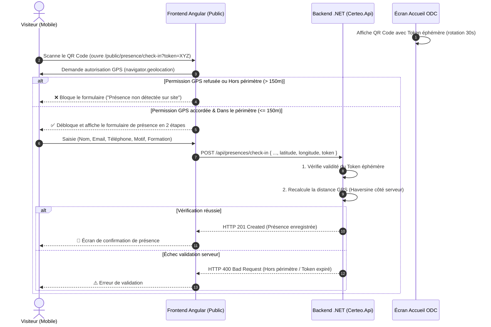

# 📍 Spécification & Guide d'Implémentation : Geofencing & Anti-Fraude Présence (ODC)

Ce document décrit en détail la mise en place du système de **Geofencing GPS** et de **QR Code Dynamique** pour le module **Présence (ODC Presence)** de CERTEO.

---

## 🎯 1. Objectifs & Cas d'Usage

Pour éviter les fausses présences (ex: scan du QR Code depuis chez soi, transfert d'URL à un ami), le système combine deux niveaux de protection :
1. **Périmètre Géographique (Geofencing GPS)** : L'utilisateur doit se trouver physiquement dans un rayon défini (ex: **150 mètres**) autour du bâtiment Orange Digital Center pour débloquer le formulaire.
2. **QR Code Dynamique Éphémère (TOTP)** : Le QR Code affiché sur l'écran d'accueil change toutes les 30 à 60 secondes avec un jeton sécurisé à durée de vie limitée.
3. **Double Vérification Serveur** : Le backend (.NET) valide les coordonnées GPS et le jeton avant toute insertion en base.

---

## 🔄 2. Séquence d'Échange (Frontend ↔ Backend ↔ Visiteur)



---

## 📐 3. Formule Mathématique : Distance de Haversine

Pour calculer la distance à vol d'oiseau entre deux points géographiques $(lat_1, lon_1)$ et $(lat_2, lon_2)$ sur la surface terrestre :

$$a = \sin^2\left(\frac{\Delta \text{lat}}{2}\right) + \cos(\text{lat}_1) \cdot \cos(\text{lat}_2) \cdot \sin^2\left(\frac{\Delta \text{lon}}{2}\right)$$
$$c = 2 \cdot \text{atan2}\left(\sqrt{a}, \sqrt{1-a}\right)$$
$$d = R \cdot c \quad \text{avec } R = 6\,371\,000\text{ mètres (rayon terrestre)}$$

---

## 💻 4. Implémentation Frontend (Angular)

### A. Service de Géolocalisation (`geolocation.service.ts`)

```typescript
// src/app/features/presence/services/geolocation.service.ts
import { Injectable, signal } from '@angular/core';

export interface Coordinates {
  latitude: number;
  longitude: number;
}

export interface GeofenceConfig {
  center: Coordinates;
  maxRadiusMeters: number;
}

@Injectable({ providedIn: 'root' })
export class GeolocationService {
  // Coordonnées GPS du centre Orange Digital Center (configurables via settings)
  private config: GeofenceConfig = {
    center: {
      latitude: 4.051056,  // Exemple : Latitude ODC
      longitude: 9.767868,  // Exemple : Longitude ODC
    },
    maxRadiusMeters: 150,   // Rayon autorisé en mètres
  };

  // Signaux réactifs pour l'UI
  readonly isChecking = signal<boolean>(false);
  readonly isWithinPerimeter = signal<boolean | null>(null);
  readonly currentDistance = signal<number | null>(null);
  readonly userCoords = signal<Coordinates | null>(null);
  readonly errorMessage = signal<string | null>(null);

  /**
   * Déclenche la demande de position et calcule l'éligibilité géographique
   */
  checkLocation(): Promise<boolean> {
    this.isChecking.set(true);
    this.errorMessage.set(null);

    return new Promise((resolve) => {
      if (!navigator.geolocation) {
        this.setError("La géolocalisation n'est pas supportée par votre navigateur.");
        resolve(false);
        return;
      }

      navigator.geolocation.getCurrentPosition(
        (position) => {
          const coords: Coordinates = {
            latitude: position.coords.latitude,
            longitude: position.coords.longitude,
          };

          this.userCoords.set(coords);
          const distance = this.calculateDistance(coords, this.config.center);
          const roundedDistance = Math.round(distance);
          this.currentDistance.set(roundedDistance);
          this.isChecking.set(false);

          if (distance <= this.config.maxRadiusMeters) {
            this.isWithinPerimeter.set(true);
            this.errorMessage.set(null);
            resolve(true);
          } else {
            this.isWithinPerimeter.set(false);
            this.errorMessage.set(
              `Vous êtes à environ ${roundedDistance}m du centre. Vous devez être à moins de ${this.config.maxRadiusMeters}m pour vous enregistrer.`
            );
            resolve(false);
          }
        },
        (error) => {
          this.isChecking.set(false);
          this.isWithinPerimeter.set(false);
          switch (error.code) {
            case error.PERMISSION_DENIED:
              this.errorMessage.set("Veuillez autoriser l'accès GPS pour valider votre présence sur site.");
              break;
            case error.POSITION_UNAVAILABLE:
              this.errorMessage.set("Position GPS introuvable. Vérifiez que la localisation est activée.");
              break;
            case error.TIMEOUT:
              this.errorMessage.set("Délai d'attente GPS dépassé. Veuillez réessayer.");
              break;
            default:
              this.errorMessage.set("Erreur lors de la récupération de votre position.");
          }
          resolve(false);
        },
        {
          enableHighAccuracy: true, // Précision GPS maximale requise
          timeout: 10000,
          maximumAge: 0,
        }
      );
    });
  }

  private calculateDistance(coord1: Coordinates, coord2: Coordinates): number {
    const R = 6371e3;
    const dLat = this.toRadians(coord2.latitude - coord1.latitude);
    const dLon = this.toRadians(coord2.longitude - coord1.longitude);

    const a =
      Math.sin(dLat / 2) * Math.sin(dLat / 2) +
      Math.cos(this.toRadians(coord1.latitude)) *
        Math.cos(this.toRadians(coord2.latitude)) *
        Math.sin(dLon / 2) *
        Math.sin(dLon / 2);

    const c = 2 * Math.atan2(Math.sqrt(a), Math.sqrt(1 - a));
    return R * c;
  }

  private toRadians(degrees: number): number {
    return (degrees * Math.PI) / 180;
  }

  private setError(msg: string): void {
    this.isChecking.set(false);
    this.isWithinPerimeter.set(false);
    this.errorMessage.set(msg);
  }
}
```

---

## ⚙️ 5. Implémentation Backend (.NET 10 / ASP.NET Core)

### A. Validateur Côté Serveur

Le backend ne doit **jamais** faire confiance uniquement au client.

```csharp
// Certeo.Api / Modules / Presence / Services / GeofenceValidator.cs
namespace Certeo.Api.Modules.Presence.Services;

public class GeofenceValidator
{
    private const double EarthRadiusMeters = 6371000.0;
    
    // Coordonnées ODC récupérées depuis la configuration ou DB
    private readonly double _centerLat;
    private readonly double _centerLon;
    private readonly double _maxRadiusMeters;

    public GeofenceValidator(IConfiguration config)
    {
        _centerLat = config.GetValue<double>("OdcLocation:Latitude", 4.051056);
        _centerLon = config.GetValue<double>("OdcLocation:Longitude", 9.767868);
        _maxRadiusMeters = config.GetValue<double>("OdcLocation:MaxRadiusMeters", 150.0);
    }

    public bool IsWithinPerimeter(double userLat, double userLon, out double calculatedDistance)
    {
        calculatedDistance = CalculateHaversineDistance(_centerLat, _centerLon, userLat, userLon);
        return calculatedDistance <= _maxRadiusMeters;
    }

    public static double CalculateHaversineDistance(double lat1, double lon1, double lat2, double lon2)
    {
        var dLat = ToRadians(lat2 - lat1);
        var dLon = ToRadians(lon2 - lon1);

        var a = Math.Sin(dLat / 2) * Math.Sin(dLat / 2) +
                Math.Cos(ToRadians(lat1)) * Math.Cos(ToRadians(lat2)) *
                Math.Sin(dLon / 2) * Math.Sin(dLon / 2);

        var c = 2 * Math.Atan2(Math.Sqrt(a), Math.Sqrt(1 - a));
        return EarthRadiusMeters * c;
    }

    private static double ToRadians(double degrees) => degrees * Math.PI / 180.0;
}
```

### B. Endpoint de Check-in

```csharp
// Certeo.Api / Modules / Presence / Endpoints / CheckInEndpoint.cs
app.MapPost("/api/presences/check-in", async (
    CheckInRequest request, 
    GeofenceValidator geofence, 
    PresenceDbContext db) =>
{
    // 1. Validation Geofencing
    if (!geofence.IsWithinPerimeter(request.Latitude, request.Longitude, out var distance))
    {
        return Results.BadRequest(new 
        { 
            Success = false, 
            Message = $"Enregistrement refusé : vous êtes hors du périmètre ODC ({Math.Round(distance)}m détectés)." 
        });
    }

    // 2. Enregistrement en base de données
    var presence = new PresenceEntry
    {
        Id = Guid.NewGuid(),
        VisitorName = request.VisitorName,
        Email = request.Email,
        Phone = request.Phone,
        VisitReason = request.VisitReason,
        TrainingId = request.TrainingId,
        CheckInTime = DateTime.UtcNow,
        Latitude = request.Latitude,
        Longitude = request.Longitude,
        DistanceMeters = (int)distance
    };

    db.Presences.Add(presence);
    await db.SaveChangesAsync();

    return Results.Created($"/api/presences/{presence.Id}", presence);
});
```

---

## 🛡️ 6. Matrice des Erreurs & UX Mobile

| Cas | Comportement UI | Action Utilisateur |
| :--- | :--- | :--- |
| **GPS désactivé ou non supporté** | Message clair invitant à activer la localisation | Bouton "Réessayer" |
| **Permission refusée** | Alerte expliquant que le check-in nécessite le GPS | Instructions pour débloquer dans les paramètres du navigateur |
| **Hors périmètre (> 150m)** | Affichage de la distance estimée et message "Présence non détectée sur site" | Bouton "Actualiser ma position" |
| **Position validée (<= 150m)** | Déblocage fluide du formulaire avec indicateur vert `📍 Présence vérifiée sur site` | Remplissage normal du formulaire |

---

## 🚀 7. Paramétrage Dynamique

Les coordonnées du centre et le rayon de tolérance peuvent être configurés dynamiquement dans le module **Settings (`features/settings`)** :
- `OdcLocation:Latitude`
- `OdcLocation:Longitude`
- `OdcLocation:MaxRadiusMeters` (défaut : 150m pour couvrir les étages et la cour intérieure du bâtiment).
